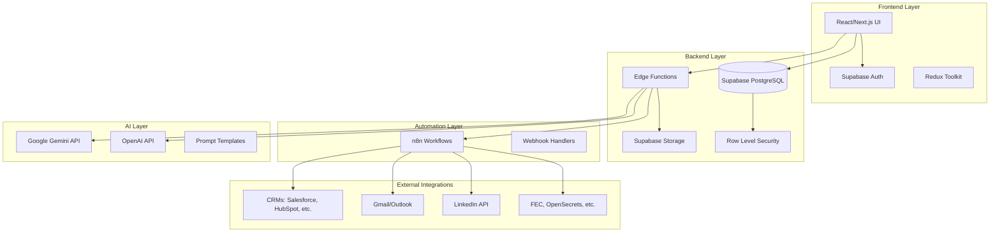

  # Design Document

## Overview

The Nexus Fundraising Intelligence Platform is built as a modern, serverless web application using React/Next.js frontend with Supabase as the backend-as-a-service. The architecture is designed for scalability, security, and seamless integration with existing CRM systems and productivity tools.

The system follows a modular, event-driven architecture with clear separation of concerns across frontend, backend, automation, and AI layers. This design enables rapid development, easy maintenance, and flexible scaling as the platform grows.

## Architecture

### High-Level Architecture



### Technology Stack

**Frontend:**
- React 18 with Next.js 14 for server-side rendering and routing
- TypeScript for type safety
- Redux Toolkit for state management
- Tailwind CSS for styling
- React Query for API state management

**Backend:**
- Supabase PostgreSQL database with Row Level Security
- Supabase Edge Functions (Deno runtime) for serverless compute
- Supabase Auth for authentication and authorization
- Supabase Storage for file management

**Automation:**
- n8n for workflow automation and CRM integrations
- Webhook-based event handling for real-time updates

**AI Services:**
- Google Gemini as primary AI provider
- OpenAI as fallback provider
- Custom prompt templates stored in database

## Components and Interfaces

### Frontend Components

#### Core UI Components
- **DashboardLayout**: Main application shell with navigation
- **DonorSearch**: Input form for donor name and location
- **IntelligenceBrief**: Display component for AI-generated donor insights
- **RelationshipMap**: Visual representation of warm connections
- **CRMSync**: Integration status and configuration panel
- **ProjectMatcher**: Upload and alignment analysis interface

#### State Management
- **donorSlice**: Manages donor data and search state
- **authSlice**: Handles user authentication state
- **crmSlice**: Manages CRM integration status and data
- **aiSlice**: Tracks AI processing status and results

### Backend Components

#### Database Schema

```sql
-- Users and Organizations
CREATE TABLE organizations (
    id UUID PRIMARY KEY DEFAULT gen_random_uuid(),
    name TEXT NOT NULL,
    created_at TIMESTAMP WITH TIME ZONE DEFAULT NOW()
);

CREATE TABLE profiles (
    id UUID PRIMARY KEY REFERENCES auth.users(id),
    organization_id UUID REFERENCES organizations(id),
    email TEXT NOT NULL,
    full_name TEXT,
    role TEXT DEFAULT 'user'
);

-- Donor Intelligence
CREATE TABLE donors (
    id UUID PRIMARY KEY DEFAULT gen_random_uuid(),
    organization_id UUID REFERENCES organizations(id),
    name TEXT NOT NULL,
    location TEXT,
    intelligence_data JSONB,
    last_updated TIMESTAMP WITH TIME ZONE DEFAULT NOW()
);

-- Relationships and Connections
CREATE TABLE relationships (
    id UUID PRIMARY KEY DEFAULT gen_random_uuid(),
    donor_id UUID REFERENCES donors(id),
    organization_id UUID REFERENCES organizations(id),
    connection_type TEXT, -- 'direct', 'mutual', 'linkedin'
    strength_score INTEGER, -- 1-10 scale
    contact_info JSONB,
    last_interaction TIMESTAMP WITH TIME ZONE
);

-- Projects and Alignment
CREATE TABLE projects (
    id UUID PRIMARY KEY DEFAULT gen_random_uuid(),
    organization_id UUID REFERENCES organizations(id),
    name TEXT NOT NULL,
    description TEXT,
    concept_note TEXT,
    funding_goal DECIMAL
);

CREATE TABLE donor_project_alignments (
    id UUID PRIMARY KEY DEFAULT gen_random_uuid(),
    donor_id UUID REFERENCES donors(id),
    project_id UUID REFERENCES projects(id),
    alignment_score DECIMAL,
    analysis_data JSONB,
    created_at TIMESTAMP WITH TIME ZONE DEFAULT NOW()
);

-- CRM Integrations
CREATE TABLE crm_integrations (
    id UUID PRIMARY KEY DEFAULT gen_random_uuid(),
    organization_id UUID REFERENCES organizations(id),
    crm_type TEXT NOT NULL, -- 'salesforce', 'hubspot', etc.
    credentials JSONB, -- encrypted
    sync_status TEXT DEFAULT 'active',
    last_sync TIMESTAMP WITH TIME ZONE
);
```

#### Edge Functions

**donor-intelligence-generator**
- Processes donor search requests
- Orchestrates AI analysis and data enrichment
- Returns structured intelligence briefs

**relationship-analyzer**
- Analyzes email communication patterns
- Integrates with LinkedIn for network mapping
- Calculates relationship strength scores

**crm-sync-handler**
- Manages bidirectional CRM synchronization
- Handles webhook events from CRM systems
- Updates local database with CRM changes

**engagement-recommender**
- Generates personalized outreach strategies
- Creates email templates and talking points
- Suggests optimal timing and approach

### Integration Interfaces

#### CRM Integration Layer
```typescript
interface CRMIntegration {
  type: 'salesforce' | 'hubspot' | 'bloomerang' | 'kindful' | 'neonone';
  authenticate(): Promise<AuthResult>;
  syncDonor(donor: Donor): Promise<SyncResult>;
  fetchUpdates(): Promise<DonorUpdate[]>;
  createActivity(activity: Activity): Promise<ActivityResult>;
}
```

#### AI Service Interface
```typescript
interface AIService {
  generateDonorIntelligence(donorInfo: DonorInput): Promise<IntelligenceBrief>;
  analyzeProjectAlignment(donor: Donor, project: Project): Promise<AlignmentAnalysis>;
  generateEngagementStrategy(context: EngagementContext): Promise<EngagementPlan>;
  analyzeCommunication(emails: Email[]): Promise<RelationshipInsights>;
}
```

## Data Models

### Core Data Models

```typescript
interface Donor {
  id: string;
  organizationId: string;
  name: string;
  location?: string;
  intelligenceData: {
    background: string;
    interests: string[];
    givingHistory: GivingRecord[];
    connections: Connection[];
    publicProfile: PublicProfile;
  };
  lastUpdated: Date;
}

interface IntelligenceBrief {
  donorId: string;
  summary: string;
  keyInsights: string[];
  givingCapacity: 'high' | 'medium' | 'low';
  preferredCauses: string[];
  connectionPoints: ConnectionPoint[];
  recommendedApproach: string;
  confidence: number; // 0-1 scale
}

interface Relationship {
  id: string;
  donorId: string;
  connectionType: 'direct' | 'mutual' | 'linkedin';
  strengthScore: number; // 1-10
  contactInfo: ContactInfo;
  lastInteraction?: Date;
  relationshipNotes: string;
}

interface Project {
  id: string;
  organizationId: string;
  name: string;
  description: string;
  conceptNote?: string;
  fundingGoal: number;
  targetDonors: string[];
}

interface AlignmentAnalysis {
  donorId: string;
  projectId: string;
  alignmentScore: number; // 0-1 scale
  matchingInterests: string[];
  potentialConcerns: string[];
  recommendedTalkingPoints: string[];
  suggestedAskAmount: number;
}
```

## Error Handling

### Error Categories and Responses

**Authentication Errors**
- Invalid credentials: Redirect to login with clear message
- Expired tokens: Automatic refresh with fallback to re-authentication
- Insufficient permissions: Display access denied with contact information

**AI Processing Errors**
- API rate limits: Queue requests with user notification
- Insufficient data: Partial results with data gap indicators
- Service unavailability: Fallback to alternative AI provider

**CRM Integration Errors**
- Connection failures: Retry mechanism with exponential backoff
- Sync conflicts: User-guided conflict resolution interface
- API changes: Graceful degradation with admin notifications

**Data Validation Errors**
- Invalid input: Real-time validation with helpful error messages
- Missing required fields: Progressive disclosure of requirements
- Format errors: Auto-correction suggestions where possible

### Error Recovery Strategies

```typescript
interface ErrorHandler {
  handleAIError(error: AIError): Promise<RecoveryAction>;
  handleCRMError(error: CRMError): Promise<SyncStrategy>;
  handleAuthError(error: AuthError): Promise<AuthAction>;
  logError(error: Error, context: ErrorContext): void;
}
```

## Testing Strategy

### Testing Pyramid

**Unit Tests (70%)**
- Component rendering and behavior
- Utility functions and data transformations
- Edge function logic
- Database query functions

**Integration Tests (20%)**
- API endpoint functionality
- Database operations with real data
- CRM integration workflows
- AI service interactions

**End-to-End Tests (10%)**
- Complete user workflows
- Cross-browser compatibility
- Performance benchmarks
- Security penetration testing

### Test Implementation

**Frontend Testing**
- Jest and React Testing Library for component tests
- Cypress for end-to-end user workflows
- Storybook for component documentation and visual testing

**Backend Testing**
- Deno test framework for Edge Functions
- Supabase local development for database testing
- Mock services for external API testing

**Performance Testing**
- Lighthouse CI for frontend performance
- Load testing for Edge Functions
- Database query optimization testing

### Continuous Integration

```yaml
# GitHub Actions workflow
name: CI/CD Pipeline
on: [push, pull_request]
jobs:
  test:
    runs-on: ubuntu-latest
    steps:
      - uses: actions/checkout@v3
      - name: Setup Node.js
        uses: actions/setup-node@v3
      - name: Install dependencies
        run: npm ci
      - name: Run tests
        run: npm run test:ci
      - name: Run E2E tests
        run: npm run test:e2e
      - name: Deploy to staging
        if: github.ref == 'refs/heads/main'
        run: npm run deploy:staging
```

This design provides a solid foundation for building the Nexus platform with clear separation of concerns, robust error handling, and comprehensive testing strategies. The modular architecture allows for incremental development and easy maintenance as the platform evolves.